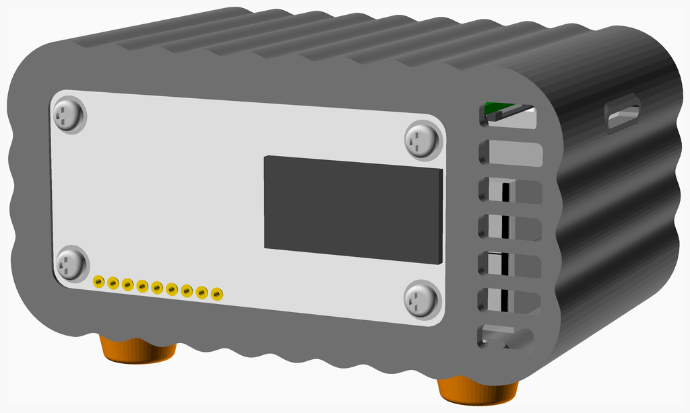
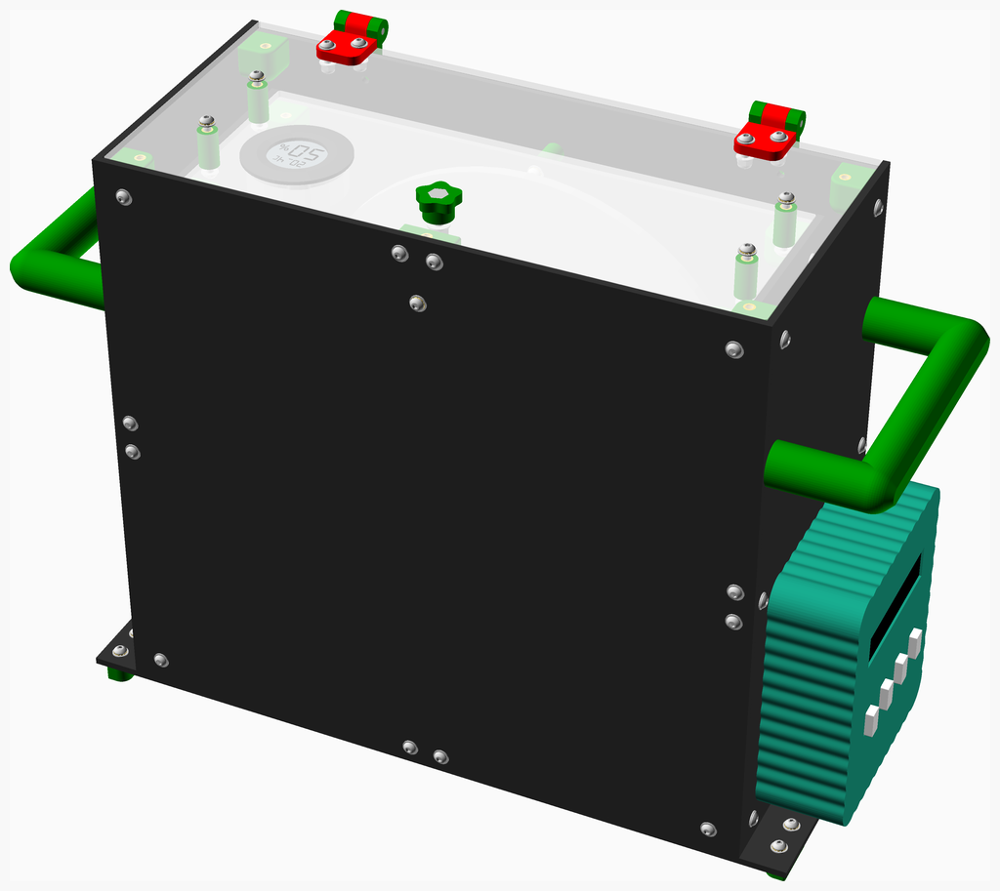
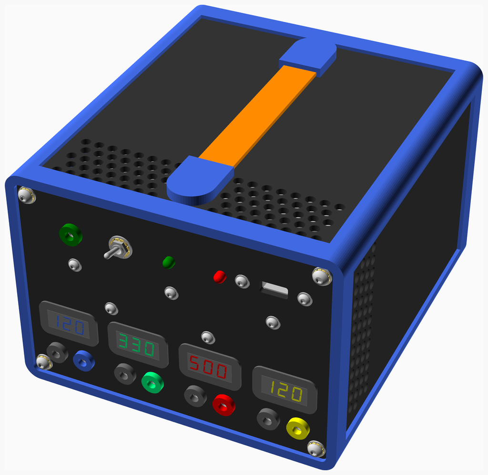
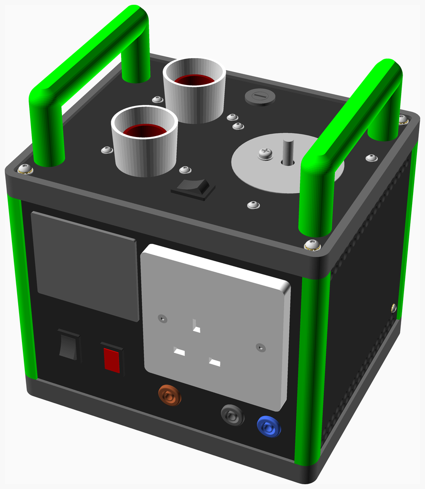

# A gallery of projects made with NopSCADlib

## ArduinoThermostat
Arduino thermostat to control a beer fridge to use it as an environmental chamber.

## EnviroPlus
Environmental monitor using Enviro+ sensor board and a Raspberry Pi Zero.

## FilamentDryBox
A small fan oven with a spool holder to keep the filament warm and dry.

## HydraBot
Current state of HydraRaptor after being modified for laser engraving.

## IOT 50V PSU
WiFi controllable PSU

## Lab ATX PSU
Bench power supply built around an ATX PSU.

* Cheap LED voltmeters show the voltage on the four main outputs.
* The 5V standby output is available from a USB socket. The main PSU can be switched on with a switch or by pulling the green socket next to it low.
* The green LED shows the power good signal.
* Dummy loads keep the outputs in range.

## Laser Load
15kV dummy load for testing CO2 laser PSUs

## MainsBreakOutBox
13A socket break out box with 4mm jacks to measure voltage and / or load current and earth leakage current.

Intended as a simple example of NopSCADlib use. Don't build it unless you understand the safety implications of working with mains electricity. In the words of
the great [Paul Carlson](https://www.youtube.com/channel/UCU9SoQxJewrWb_3GxeteQPA), "if you are following along, you are doing so at your own risk".

In normal use the neutral jack sockets are linked with a short lead and so are the two earth jacks. Current can be safely measured using a clamp ammeter around the neutral link.

Voltage and current waveforms can be measured simultaneously with a [Mooshimeter](https://moosh.im/) CAT III multimeter connected to the bottom three jacks.

Earth leakage current can be measured by connecting an AC milliampere meter between the two earth jacks. The DUT must be mounted on an insulated substrate and must not be touched
while its earth is disconnected. Don't be tempted to float the earth of an oscilloscope this way, use a mains isolation transformer to power the DUT instead.
Earth leakage can be measured Canadian CSA style by disconnected the neutral link from the left socket and linking the central neutral to the live.

## Mains Box
Mains isolated and variable supply with metering.

## SunBot
A solar tracker to keep solar powerbanks pointing at the sun.

## Turntable
WiFi enabled remote control turntable for photography

## Variac
Motorised variac with WiFi control, see [hydraraptor.blogspot.com/2018/04/esp8266-spi-spy](https://hydraraptor.blogspot.com/2018/04/esp8266-spi-spy.html)

